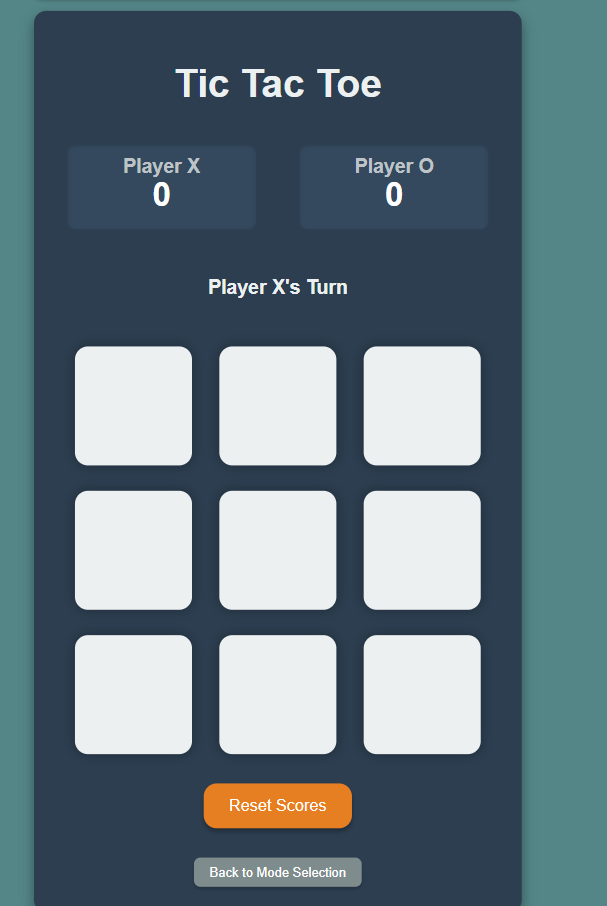
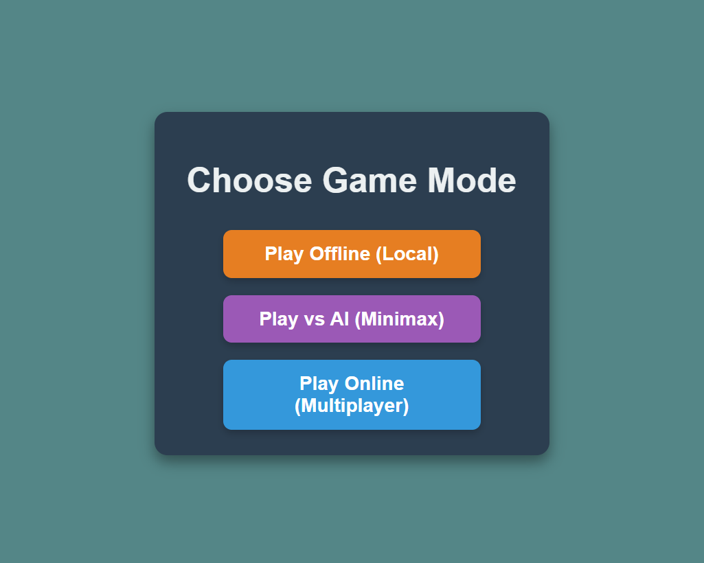
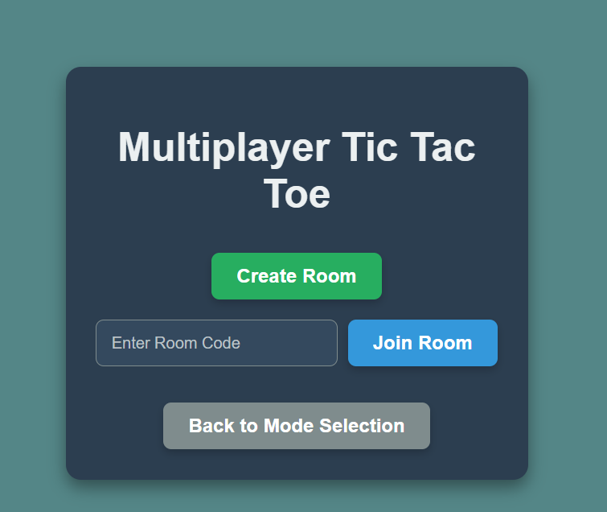

# Tic Tac Toe Game
A modern, multiplayer Tic Tac Toe game with three exciting game modes!

## 📸 Screenshots

### Game Board


### Mode Selection


### Multiplayer Setup


## 🎮 Game Modes
- **Offline Mode**: Play locally with a friend on the same device
- **AI Mode**: Challenge an intelligent AI opponent using the Minimax algorithm
- **Online Mode**: Play with friends remotely using unique room codes

## 🚀 Features
- Clean, responsive design
- Real-time multiplayer functionality
- Smart AI opponent
- Score tracking
- Mobile-friendly interface
- Dark theme UI

## 🛠️ Technologies Used
- **Frontend**: HTML5, CSS3, JavaScript (ES6+)
- **Backend**: Node.js, Express.js
- **Real-time Communication**: Socket.io
- **AI Algorithm**: Minimax with Alpha-Beta pruning

## 📦 Installation
1. Clone the repository:
   ```bash
   git clone https://github.com/YOUR_USERNAME/tic-tac-toe-game.git
   cd tic-tac-toe-game
   ```

2. Install dependencies:
   ```bash
   npm install
   ```

3. Start the server:
   ```bash
   npm start
   ```

4. Open your browser and navigate to `http://localhost:3000`

## 🎯 How to Play

### Offline Mode
1. Select "Play Offline (Local)" from the mode selection
2. Take turns clicking on the grid squares
3. First player to get three in a row wins!

### AI Mode  
1. Choose "Play vs AI (Minimax)" 
2. You play as X, AI plays as O
3. Try to outsmart the AI algorithm!

### Online Mode
1. Select "Play Online (Multiplayer)"
2. Create a room or join with a room code
3. Share the room code with your friend
4. Play in real-time!

## 🏆 Game Rules
- Players take turns placing X's and O's on a 3x3 grid
- Win by getting three of your marks in a row (horizontal, vertical, or diagonal)
- If all squares are filled with no winner, it's a tie
- Scores are tracked across multiple games